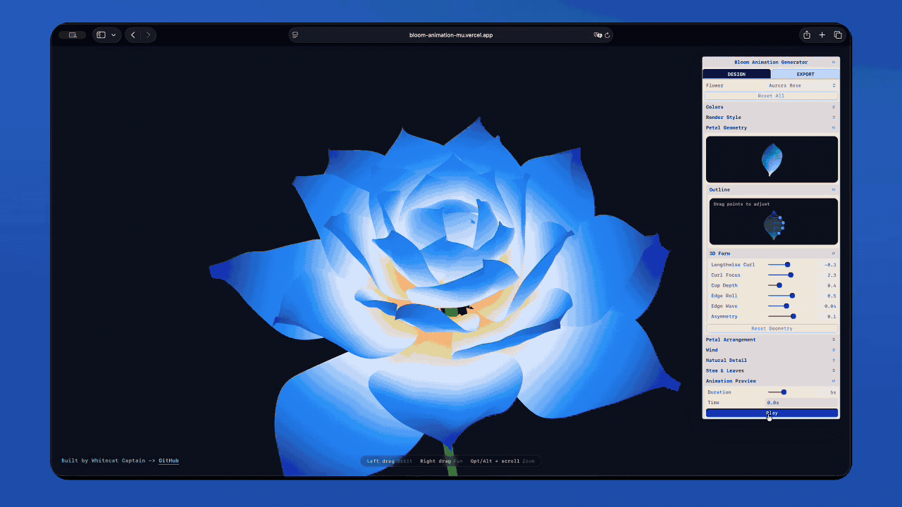

# Bloom Animation Generator

[English](./README.md) | [Chinese](./README.zh.md)

将一张花朵参考图转化为程序化、可编辑且可导出的绽放动画。

上传一张参考图，让Skill根据它生成花朵，然后继续在内置的Flower Studio中编辑。这个仓库已经包含Studio、花朵引擎、控制项和导出工具；每朵新花都会保存为数据，无需再创建一个Next.js项目。



## 安装

### 让你的Agent安装

最简单的方法，是将下面这段话粘贴到与Codex、Claude Code、Cursor或其他兼容Agent Skills的Agent的对话中：

```text
从以下地址安装 bloom-animation-generator Agent Skill：
https://github.com/whitecat-captain/bloom-animation
```

你的Agent会将Skill放到它所支持的位置。如果Skill没有立即出现，请开始一个新对话或重启Agent。

如果你希望在本地保留一份仓库副本，请使用：

```bash
git clone https://github.com/whitecat-captain/bloom-animation.git
cd bloom-animation
python3 scripts/install_skill.py
```

这会将仓库中的Skill链接到共享的Agent Skills文件夹中，因此以后拉取仓库更新时，已安装的Skill也会同步更新。

## 使用

附上一张花朵图片，然后输入：

```text
使用 bloom-animation-generator Skill，将这张参考图转化为 Flower Studio 中可编辑的绽放动画。
```

Skill会分析图中可见的结构、色彩和绽放状态，将它们转化为现有程序化花朵系统中的参数，保存这朵花，并在内置Studio中打开聚焦的Quick视图。完整的设计控制仍可在Advanced中使用，Export则保留了完整的图像与动画导出流程。

首次使用时，Skill可能需要稍长时间来准备Flower Studio。你无需选择目标文件夹、创建新的Web项目，也无需单独安装依赖。之后生成的花朵会复用同一个Studio，并与先前的结果一起保留。

这个引擎是视觉转译工具，而不是植物学重建系统。复杂的花蕊、多种花瓣形态、水滴或强烈不对称的解剖结构等细节可能会经过近似处理，同时保留花朵的整体特征。

## 包含内容

```text
SKILL.md              # 工作流程与视觉约束
agents/               # Agent展示元数据
references/           # FlowerSpec与引擎能力映射
scripts/              # 安装、存储与运行辅助脚本
studio/               # 可复用的Studio、花朵引擎与导出工具
```

内置的Next.js应用是可复用的运行环境和演示，而不是每次生成结果时都复制一份的应用模板。生成的花朵与Skill分开存储，因此更新仓库不会将它们删除。

## 兼容性

Skill使用开放的`SKILL.md` Agent Skills格式，但目前完整的工作流程是针对本地体验设计并测试的。

| 环境 | 当前支持情况 |
| --- | --- |
| Codex应用、CLI和IDE扩展 | 已支持并经过测试。 |
| Cursor编辑器和CLI | Skill格式与共享安装位置兼容；完整的花朵工作流程仍需进行专门的端到端测试。 |
| Claude Code | Skill内容兼容，但Claude Code使用自己的Skill文件夹和调用方式。请将它安装到`~/.claude/skills`，并通过`/bloom-animation-generator`调用。 |
| Codex Cloud和其他云端Agent | 它们可以检查并运行仓库，但目前的结果流程需要本地浏览器和持久化的本地花朵库，尚无法提供同样的一键式交互体验。 |

`agents/openai.yaml`只添加Codex专用的展示元数据。其他兼容Agent可以忽略它，并使用相同的`SKILL.md`、脚本、参考资料和Studio资源。

## 直接运行Flower Studio

通常情况下，Skill会自动准备并打开Studio。若要自行运行内置演示，请执行：

```bash
npm install --prefix studio
npm run dev --prefix studio
```

然后打开`http://localhost:3000/studio`。

现有的在线演示位于[bloom-animation-mu.vercel.app](https://bloom-animation-mu.vercel.app)。创建新的Vercel项目时，请将Root Directory设置为`studio`。

## 更新或移除

如果使用了链接式本地安装，请运行以下命令更新：

```bash
git pull
```

若要移除，请只删除`~/.agents/skills/bloom-animation-generator`中已安装的Skill链接。这不会删除仓库或先前生成的花朵。你也可以让Agent为你更新或卸载Skill。

## 致谢

程序化花朵绽放方法最初学习自[Danny Laursen的Flower Bloom系列教程](https://www.youtube.com/watch?v=aUajIqvl6H4&list=PLOGJpcoBCf0MhmgDJKTY9SMJJDWrhYLIu)。
